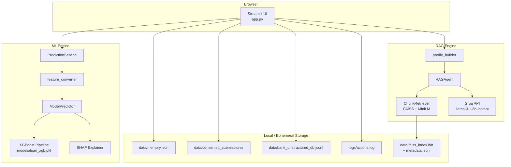
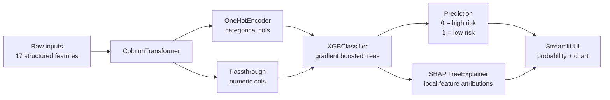
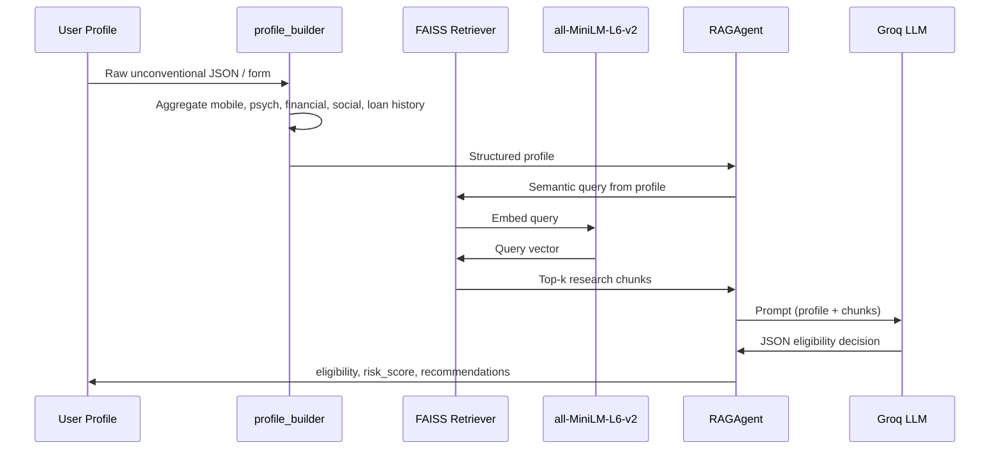

# GigBridge — RAG-based Microfinance Eligibility Agent

A dual-engine microfinance eligibility platform combining **XGBoost + SHAP** (structured loan data) and **RAG + Groq LLM** (unconventional behavioral data), with ethical consent flows and a Streamlit UI for assessing microfinance eligibility using unconventional data sources (mobile metadata, psychometrics, financial behavior, social networks) and research evidence.

## Live demo

**Try the deployed app:** [https://gigbridge.streamlit.app/](https://gigbridge.streamlit.app/)

**Repository:** [github.com/Sahil2927/GigBridge-RAG-based-Microfinance-Eligibility-Agent](https://github.com/Sahil2927/GigBridge-RAG-based-Microfinance-Eligibility-Agent)

---

## Overview

This system supports two complementary assessment paths:

| Path | Input | Engine | Output |
|------|--------|--------|--------|
| **ML** | 17 structured loan features (age, income, credit score, DTI, etc.) | XGBoost + SHAP | Binary eligibility, probability, feature attributions |
| **RAG** | Unconventional data (mobile, psychometrics, savings, SHG, loan history) | FAISS + Groq LLM | yes/no/maybe, risk score, narrative verdict |

Shared capabilities:

- Profile building and schema validation
- Explicit consent before bank submission
- Admin dashboard for consented submissions
- Wellness Coach and Transparency & Ethics pages
- Auto-bootstrap of demo model + knowledge base on first run (local & Streamlit Cloud)

---

## System architecture



---

## ML model architecture



**Training data:** `Loan_default.csv` (synthetic demo CSV generated by bootstrap, or real Kaggle data)

**Features (17):** `LoanID`, `Age`, `Income`, `LoanAmount`, `CreditScore`, `MonthsEmployed`, `NumCreditLines`, `InterestRate`, `LoanTerm`, `DTIRatio`, `Education`, `EmploymentType`, `MaritalStatus`, `HasMortgage`, `HasDependents`, `LoanPurpose`, `HasCoSigner`

**Train / export:**
```bash
python scripts/export_model_from_notebook.py --csv-path data/Loan_default.csv
# or quick demo bootstrap:
python scripts/bootstrap.py
```

---

## RAG pipeline architecture



**Knowledge base sources:**
- **Demo (default):** embedded research snippets → built by `scripts/create_demo_kb.py` / bootstrap
- **Production:** PDFs in `research_papers/` → `python run_ingestion.py`

**Embedding model:** `all-MiniLM-L6-v2` (384-d) · **Vector store:** FAISS (flat index)

---

## Features

- **Dual assessment modes:** ML only, RAG only, or Both
- **ML + SHAP:** XGBoost predictions with Plotly SHAP waterfall charts
- **RAG + Groq:** Research-grounded eligibility with strong/weak points and recommendations
- **Knowledge base ingestion:** PDF → chunk → embed → FAISS
- **Profile building:** Raw logs → validated profile schema
- **Consent management:** Submit or delete all data on decline
- **Admin view:** Password-protected submission dashboard (set `ADMIN_PASSWORD` in secrets)
- **Wellness Coach:** Guidance for ineligible applicants
- **Transparency & Ethics:** SHAP explainer, GDPR-style rights, FAQ
- **Cloud-ready bootstrap:** Auto-builds demo model + KB on Streamlit cold start

---

## Quick start (local)

### Prerequisites

- Python **3.11** recommended (3.8+ supported locally)
- [Groq API key](https://console.groq.com/) (required for RAG)
- Optional: research PDFs in `research_papers/` for custom KB

### 1. Clone and install

```bash
git clone https://github.com/Sahil2927/GigBridge-RAG-based-Microfinance-Eligibility-Agent.git
cd GigBridge-RAG-based-Microfinance-Eligibility-Agent
pip install -r requirements.txt
```

### 2. Configure environment

```bash
cp .env.example .env
# Edit .env:
#   GROQ_API_KEY=gsk_...
#   GROQ_MODEL_NAME=llama-3.1-8b-instant
#   ADMIN_PASSWORD=your-password
```

### 3. Bootstrap artifacts (first run)

```bash
python scripts/bootstrap.py
```

Creates `models/loan_xgb.pkl`, `data/faiss_index.bin`, and `data/metadata.jsonl`.

### 4. Run the app

```bash
streamlit run app.py
```

Open [http://localhost:8501](http://localhost:8501)

### 5. Verify connectivity (optional)

```bash
python scripts/verify_system.py   # full audit
python scripts/test_rag_live.py   # live Groq + RAG test
python -m pytest tests/ -q
```

---

## Deploy to Streamlit Cloud

Full guide: [DEPLOYMENT.md](DEPLOYMENT.md)

| Setting | Value |
|---------|--------|
| Main file | `app.py` |
| Branch | `main` |
| Python | **3.11** |

**Secrets** (Manage app → Settings → Secrets):

```toml
GROQ_API_KEY = "gsk_your_key_here"
GROQ_MODEL_NAME = "llama-3.1-8b-instant"
ADMIN_PASSWORD = "choose-a-strong-password"
```

---

## Using the app

### Assessment page

1. Choose mode: **ML Model Only**, **RAG Agent Only**, or **Both**
2. **ML:** fill 17 structured fields → **Run ML Prediction**
3. **RAG:** fill demographics + unconventional sections → **Run RAG Assessment**
4. Review results → consent → submit or decline

### Admin view

- Password: value of `ADMIN_PASSWORD` (Streamlit secret or `.env`)
- View, filter, and export consented submissions

### Example profiles

Load from `example_inputs/`:

- `likely_eligible_gig_worker.json`
- `borderline_user.json`
- `not_eligible_user.json`
- `to_test_ml_model.json` (ML-only structured features)

---

## Project structure

```
GigBridge/
├── app.py                          # Streamlit UI (entry point)
├── scripts/
│   ├── bootstrap.py                # One-command local/cloud artifact setup
│   ├── create_demo_kb.py           # Demo FAISS index (no PDFs required)
│   ├── generate_synthetic_loan_data.py
│   ├── export_model_from_notebook.py
│   ├── verify_system.py            # Pre-deploy connectivity audit
│   └── test_rag_live.py            # Live RAG + Groq test
├── src/
│   ├── ml/                         # XGBoost, SHAP, feature conversion
│   ├── agent/rag_agent.py          # Groq RAG decision agent
│   ├── kb/                         # Ingest + FAISS retrieval
│   ├── profile/profile_builder.py
│   ├── memory/store.py             # Consent + audit log
│   ├── setup/artifacts.py          # Bootstrap orchestration
│   └── utils/config.py             # Secrets / env config
├── example_inputs/
├── notebooks/                      # Colab / Jupyter demos
├── tests/
├── DEPLOYMENT.md
├── requirements.txt
└── README.md
```

---

## Profile schema (RAG)

```json
{
  "user_id": "string",
  "timestamp": "ISO8601",
  "demographics": { "age": 30, "gender": "female", "occupation": "gig_worker", "monthly_income": 25000 },
  "mobile_metadata": { "avg_daily_calls": 1.0, "unique_contacts_30d": 20 },
  "psychometrics": { "conscientiousness_score": 4.2 },
  "financial_behavior": { "savings_frequency": 0.2, "bill_payment_timeliness": 0.9 },
  "social_network": { "shg_membership": true, "peer_monitoring_strength": 0.8 },
  "loan_history": { "previous_loans": 1, "previous_defaults": 0 }
}
```

See `example_inputs/likely_eligible_gig_worker.json` for a full example.

---

## RAG output schema

```json
{
  "eligibility": "yes | no | maybe",
  "risk_score": 0.0,
  "verdict_text": "Brief explanation",
  "strong_points": ["...", "...", "..."],
  "weak_points": ["...", "...", "..."],
  "required_unconventional_data": [],
  "actionable_recommendations": ["...", "...", "...", "..."],
  "confidence": "high | medium | low"
}
```

---

## ML output schema

```json
{
  "prediction": 0,
  "probability": 0.75,
  "explanation": [{ "feature": "CreditScore", "shap_value": 0.12, "abs_shap": 0.12 }],
  "next_step": { "action": "wellness_coach | proceed_application", "message": "..." },
  "meta": { "confidence_low": false, "probability_margin": 0.25 }
}
```

---

## Configuration

### Groq models

Default (verified on deploy): **`llama-3.1-8b-instant`**

Also supported: `mixtral-8x7b-32768`, `llama3-70b-8192`, `gemma-7b-it`

Set via `.env`, Streamlit Secrets, or `GROQ_MODEL_NAME`.

### Bootstrap (Streamlit Cloud)

On cold start, the app auto-builds demo artifacts unless already present.

Optional env vars:

| Variable | Default | Purpose |
|----------|---------|---------|
| `SKIP_BOOTSTRAP` | `false` | Skip auto-setup |
| `BOOTSTRAP_QUICK` | `true` | Faster training / smaller demo KB |

---

## Python API examples

### RAG assessment

```python
import os
from dotenv import load_dotenv
from src.profile.profile_builder import build_profile_from_json
from src.agent.rag_agent import RAGAgent

load_dotenv()
with open("example_inputs/likely_eligible_gig_worker.json") as f:
    import json
    profile = build_profile_from_json(json.load(f))

agent = RAGAgent(groq_api_key=os.getenv("GROQ_API_KEY"))
decision = agent.assess_eligibility(profile)
print(decision["eligibility"], decision["risk_score"])
```

### ML prediction

```python
import json
from src.ml.prediction_service import PredictionService

with open("example_inputs/to_test_ml_model.json") as f:
    ml_inputs = json.load(f)

result = PredictionService().predict_from_raw_inputs(ml_inputs, consent=False)
print(result["prediction"], result["probability"])
```

---

## Troubleshooting

| Issue | Solution |
|-------|----------|
| FAISS index not found | Run `python scripts/bootstrap.py` or `python run_ingestion.py` |
| GROQ_API_KEY not configured (cloud) | Add to Streamlit **Secrets** → Save → **Reboot app** |
| `torchvision` / `transformers` error on cloud | Ensure latest `requirements.txt` (includes `torchvision`) |
| ML model not found | Run `python scripts/bootstrap.py` |
| RAG slow on first load | Bootstrap trains model + builds KB (~30–90s) |
| Logs / deploy errors | Streamlit **Manage app → Logs** |

---

## Privacy & ethics

1. **Transparency** — SHAP (ML) and narrative verdicts (RAG)
2. **Consent** — Required before bank submission
3. **Deletion** — Decline consent → all user data removed
4. **Aggregation** — Only summary results shared, not raw logs
5. **Audit trail** — Actions logged to `logs/actions.log`

---

## License

Provided as-is for research and educational purposes.

---

## Acknowledgments

- Groq (LLM API) · Sentence-transformers · FAISS · XGBoost · SHAP · Streamlit

---

**Built for ethical AI in microfinance** · [Live demo](https://gigbridge.streamlit.app/)
